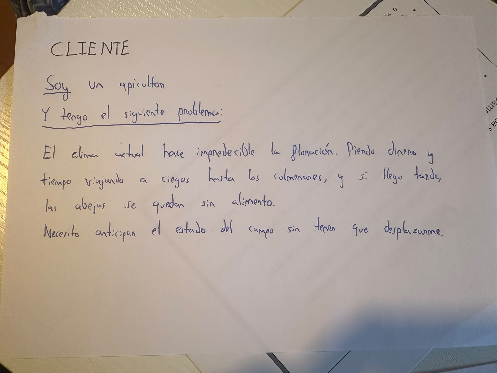
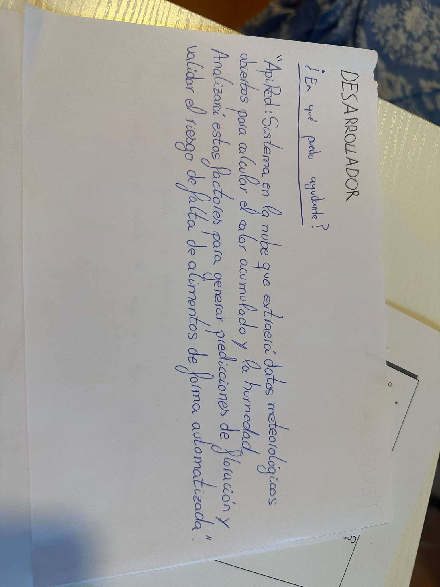

# ApiRed

1. EL PROBLEMA
Un apicultor se enfrenta a un problema que está afectando a su producción. Hasta hace unos años, era posible anticipar en qué mes florecía cada planta siguiendo el calendario tradicional. Sin embargo, el cambio climático ha vuelto estos ciclos impredecibles, provocando picos de calor inusuales en invierno o sequías prolongadas en primavera.

El problema principal es que, actualmente, la única forma de saber si el campo tiene floración disponible es desplazarse físicamente hasta el colmenar. Estos viajes a ciegas suponen un gasto innecesario de tiempo y combustible, y si la estimación falla y se llega tarde, las colmenas corren el riesgo de quedarse sin alimento.

2. LA SOLUCIÓN
Para solucionar esto, el proyecto ApiRed propone un sistema en la nube que automatice el seguimiento del campo de la siguiente manera:

    - Extraer datos meteorológicos (temperatura, precipitaciones) desde portales de datos públicos.

    - Calcular variables como el calor acumulado y el estrés hídrico de esa ubicación concreta.

    - Analizar el calor acumulado por las plantas y la falta de humedad del terreno en esa ubicación concreta.

    - Generar una estimación que prediga si la floración se va a adelantar o retrasar.

    - Validar el riesgo de escasez de néctar para las colmenas en las semanas siguientes.

3. TARJETAS
    **Perspectiva del Cliente (El problema):**
    

    **Perspectiva del Desarrollador (La solución):**
    

4. CONFIGURACIÓN
Para el desarrollo inicial de este proyecto se ha llevado a cabo la configuración del entorno local utilizando Git Bash en Windows y se ha establecido la conexión segura con GitHub mediante claves SSH.